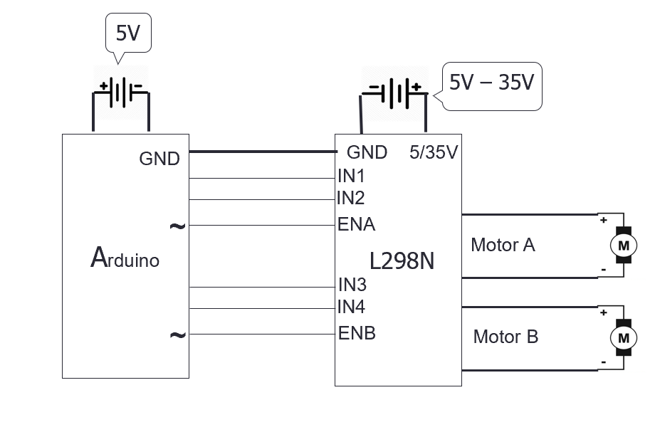
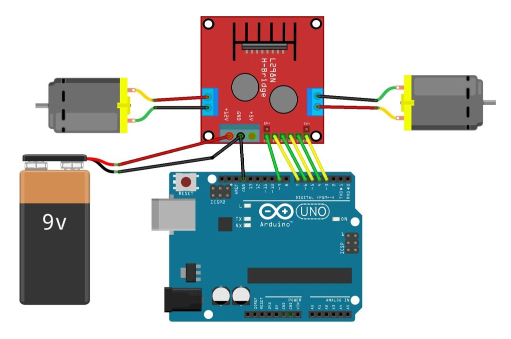
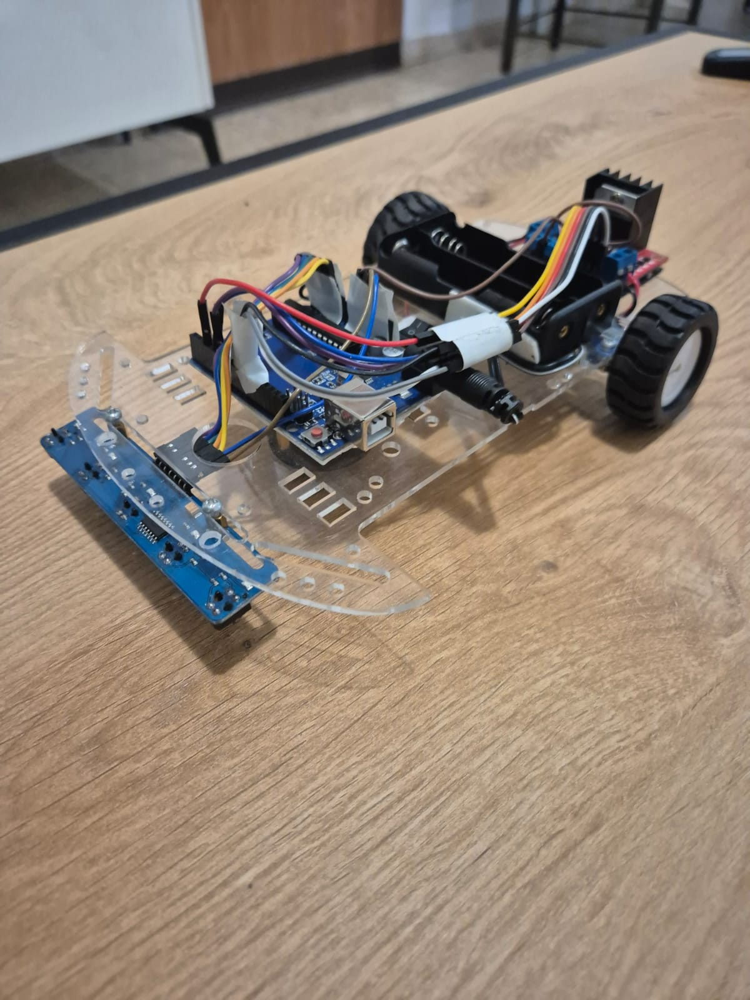

# Line Following Robot – Arduino Project

This project is an Arduino-based line-following robot using 5 IR sensors, a PID controller, and dual DC motors. It demonstrates hands-on experience with embedded systems, sensor processing, and real-time control logic.

## Project Overview
The robot performs real-time line tracking using an array of IR reflectance sensors to estimate the line’s position relative to the chassis. The control algorithm computes the lateral error—how far the robot deviates from the intended path—and a PID loop converts this error into differential motor outputs. This enables continuous trajectory correction, smooth return to the line, and stable motion even through sharp turns or brief loss of contact.

## Key Features
- 5 analog IR sensors
- PID-based steering
- Real-time line position calculation
- Automatic calibration at startup
- Stable performance on curves and during line loss

  
## Hardware Used
- Arduino Uno / Nano
- 5 IR sensors (QTR or compatible)
- Motor driver (L298N / L293D)
- 2 DC motors
- Robot chassis
- Battery pack

  
## Technical Summary
Sensor readings are processed using the QTRSensors library, mapping the line position to a 0–4000 range. A PID controller computes steering corrections based on the real-time error. Motor speeds are controlled via PWM and direction pins for smooth and predictable motion.

### PID Control Algorithm
The robot uses a PID controller to adjust its steering based on the line’s position. The **P (Proportional)** term reacts to how far the robot is from the center, the **I (Integral)** term corrects small errors that repeat over time, and the **D (Derivative)** term reduces quick side-to-side movements. By combining these three parts, the controller creates a correction value that adjusts the motor speeds, allowing the robot to follow the line smoothly and remain stable even in sharp turns.

## Design Decisions
- Selected a PID control approach to achieve smoother and more stable steering than a basic binary control method.
- Used a 5-sensor array to improve line position estimation and increase robustness when parts of the line are not fully visible.
- Chose differential motor control to maintain consistent steering behavior across different speeds and track curvature.

## Skills Developed
The development process strengthened my capabilities in embedded programming, and hardware–software integration:

- Embedded programming: writing real-time code, structuring logic, and implementing a PID controller.
- Sensor integration: working with analog IR sensors, calibrating them, and processing reflectance data.
- Electrical circuits and wiring: connecting sensors, motors, and a motor driver, understanding voltage, current, and signal flow.
- Hardware and software integration: making sure the circuit, sensors, and firmware operate correctly together.
- Debugging: diagnosing issues such as unstable movement, noise in sensor readings, wiring mistakes, and incorrect PID tuning.
- System design: planning the robot layout, organizing the project, and documenting the full build.

Each part of the project improved my confidence in working with electronics, microcontrollers, and practical problem solving.

## Video
Watch the robot in action:  
https://www.youtube.com/shorts/Qr4VZQx2bH8

## About This Project
Developed as part of my exploration into robotics and embedded systems, focusing on control algorithms, microcontroller programming, and practical hardware implementation. This project reflects my interest in engineering, automation, and real-world problem solving.

## License
MIT License

### Repository Structure
- `arduino-line-follower.ino` – Main Arduino firmware  
- `docs/` – Architecture and design documentation  
- `images/` – Project photos and diagrams  
- `README.md` – Project overview and instructions  
- `LICENSE` – MIT License
  

### Wiring Diagram (Technical Schematic)

### Wiring Diagram (Visual)

### Robot Photo

