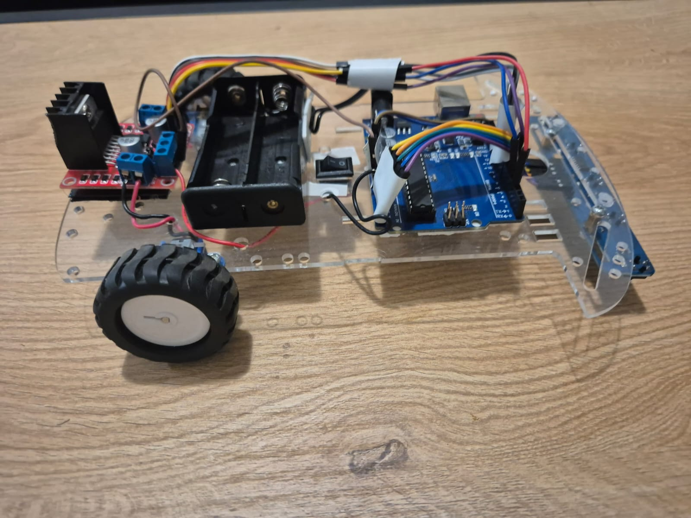

# Line Following Robot – Arduino Project

This project is an Arduino-based line-following robot using 5 IR sensors, a PID controller, and dual DC motors. It demonstrates hands-on experience with embedded systems, sensor processing, and real-time control logic.

## Project Overview
The robot detects and tracks a black line using analog IR sensors. A PID control loop calculates steering corrections, and the system performs automatic calibration while maintaining stable tracking even when the line is partially lost.

## Key Features
- 5 analog IR sensors
- PID-based steering
- Real-time line position calculation
- Automatic calibration at startup
- Stable performance on curves and during line loss
- 
## Hardware Used
- Arduino Uno / Nano
- 5 IR sensors (QTR or compatible)
- Motor driver (L298N / L293D)
- 2 DC motors
- Robot chassis
- Battery pack
- 
## Technical Summary
Sensor readings are processed using the QTRSensors library, mapping the line position to a 0–4000 range. A PID controller computes steering corrections based on the real-time error. Motor speeds are controlled via PWM and direction pins for smooth and predictable motion.

## Skills Developed
This project gave me practical hands-on experience in several core engineering areas:

- Embedded programming: writing real-time code, structuring logic, and implementing a PID controller.
- Sensor integration: working with analog IR sensors, calibrating them, and processing reflectance data.
- Electrical circuits and wiring: connecting sensors, motors, and a motor driver, understanding voltage, current, and signal flow.
- Hardware and software integration: making sure the circuit, sensors, and firmware operate correctly together.
- Debugging: diagnosing issues such as unstable movement, noise in sensor readings, wiring mistakes, and incorrect PID tuning.
- System design: planning the robot layout, organizing the project, and documenting the full build.

Each part of the project improved my confidence in working with electronics, microcontrollers, and practical problem solving.

## Video
Watch the robot in action:  
https://www.youtube.com/shorts/Qr4VZQx2bH8

## About This Project
Developed as part of my exploration into robotics and embedded systems, focusing on control algorithms, microcontroller programming, and practical hardware implementation. This project reflects my interest in engineering, automation, and real-world problem solving.

## License
MIT License

### Repository Structure
- `arduino-line-follower.ino` – Main Arduino firmware  
- `docs/` – Architecture and design documentation  
- `images/` – Project photos and diagrams  
- `README.md` – Project overview and instructions  
- `LICENSE` – MIT License  

